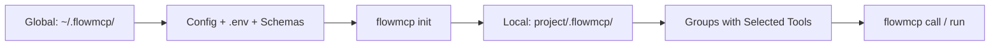

[]() 

# FlowMCP CLI

Command-line tool for developing, validating, and managing FlowMCP schemas.

## Description

FlowMCP CLI is a developer tool for working with FlowMCP schemas — structured API definitions that enable AI agents to interact with external services. The CLI provides schema validation, live API testing, repository imports, delta-based updates, and an MCP server mode for integration with AI agent frameworks like Claude Code.

## Architecture



| Level | Path | Content |
|-------|------|---------|
| **Global** | `~/.flowmcp/` | Config, .env with API keys, all imported schemas |
| **Local** | `{project}/.flowmcp/` | Project config, groups with selected tools |

## Quickstart

```bash
git clone https://github.com/FlowMCP/flowmcp-cli.git
cd flowmcp-cli
npm i
npx flowmcp init
```

## Commands

### Setup

| Command | Description |
|---------|-------------|
| `flowmcp init` | Interactive setup — creates global and local config |
| `flowmcp status` | Show config, sources, groups, and health info |
| `flowmcp --help` | Show help with health warnings |

### Tool Discovery (Agent Mode)

| Command | Description |
|---------|-------------|
| `flowmcp search <query>` | Find available tools by keyword |
| `flowmcp add <tool-name>` | Activate a tool for this project |
| `flowmcp remove <tool-name>` | Deactivate a tool |
| `flowmcp reload <tool-name>` | Remove and re-add a tool (force refresh) |
| `flowmcp list` | Show active tools |

### Schema Management

| Command | Description |
|---------|-------------|
| `flowmcp schemas` | List all available schemas and their tools |
| `flowmcp import <url> [--branch name]` | Import schemas from a GitHub repository |
| `flowmcp import-registry <url>` | Import schemas from a registry URL |
| `flowmcp update [source-name]` | Update schemas from remote registries (hash-based delta) |

### Group Management

| Command | Description |
|---------|-------------|
| `flowmcp group list` | List all groups and their tool counts |
| `flowmcp group append <name> --tools "refs"` | Add tools to a group (creates group if new) |
| `flowmcp group remove <name> --tools "refs"` | Remove tools from a group |
| `flowmcp group set-default <name>` | Set the default group |

### Prompt Management

| Command | Description |
|---------|-------------|
| `flowmcp prompt list` | List all prompts across groups |
| `flowmcp prompt search <query>` | Search prompts by keyword |
| `flowmcp prompt show <group/name>` | Show a specific prompt with content |
| `flowmcp prompt add <group> <name> --file <path>` | Add a prompt from a file |
| `flowmcp prompt remove <group> <name>` | Remove a prompt |

### Validation & Testing

| Command | Description |
|---------|-------------|
| `flowmcp validate [path]` | Validate schema structure against FlowMCP spec |
| `flowmcp validate` (no path) | Validate all schemas in the default group |
| `flowmcp validate-catalog <dir>` | Validate a catalog directory (registry, schemas, agents) |
| `flowmcp test project [--route name] [--group name]` | Test default group with live API calls |
| `flowmcp test user [--route name]` | Test all user schemas with live API calls |
| `flowmcp test single <path> [--route name]` | Test a single schema file |

### Schema Grade Report

`flowmcp dev grade` follows a 2-phase file-mode workflow (no API key required — harness produces scores).

| Command | Description |
|---------|-------------|
| `flowmcp dev grade <path> --emit-prompts [--workdir D]` | **Phase 1**: write `prompts.json` + `state.json` |
| `flowmcp dev grade <path> --consume-scores <scores.json>` | **Phase 2**: compute grade, write report |
| `--reports-dir <path>` | Override reports directory (default: `proofs/grade-reports/`) |
| `--on-conflict <skip\|abort>` | NO-OVERWRITE strategy (default: `skip`) |

For end-to-end grading (wraps both phases + Subagent scoring), use the workbench skills:

```bash
/grade-score-single --schema schemas/mudab/marine-data.mjs
/grade-score-batch --schemas grade-list.txt
```

Spec: `flowmcp-spec/spec/v4.0.0/22-scoring-protocol.md`.

### Grading

The `grading` commands run the production grading system (v2) against a local
workbench island under `grading-data/`. They are reachable both as
`flowmcp grading ...` and `flowmcp dev grading ...` (the `dev` prefix is optional).

| Command | Description |
|---------|-------------|
| `flowmcp grading import <provider-path>` | Import a provider folder into the island (Stage 0) |
| `flowmcp grading run <ns\|selection> --emit-prompts` | Stage 1: deterministic pretest + emit grading prompts (handoff) |
| `flowmcp grading run <ns\|selection> --consume-scores <path>` | Stage 3: consume harness scores, rebuild index, finalize |
| `flowmcp grading export <ns\|selection>` | Export the graded state (`index.json`) back to the source |
| `flowmcp grading state <ns\|selection>` | Show the current rollup status (read-only) |

Flags for `run`: `--phase <area>` restricts grading to a single area/skill;
`--on-conflict <abort\|skip\|overwrite>` sets the write-conflict policy
(default: no overwrite).

#### Stage model

Grading runs in four stages. The CLI owns Stages 0, 1 and 3; the **harness**
(your Claude Code agent loop) owns Stage 2.

| Stage | Owner | What happens |
|-------|-------|--------------|
| 0 — Intake | CLI | `grading import` validates the provider schemas, snapshots them into the island and normalizes resources/skills |
| 1 — Deterministic | CLI | `grading run --emit-prompts` runs the deterministic pretest (live HTTP checks — the request is never persisted) and the deterministic graders, then emits `prompts.json` + `state.json` for the handoff |
| 2 — Non-deterministic | Harness | The agent loop reads `prompts.json`/`state.json` and grades each area (`start-grade → evaluate → apply-improvement`) — this is the only stage outside the CLI |
| 3 — Finalize | CLI | `grading run --consume-scores <path>` reads the harness scores, computes grades, rebuilds `index.json` (5-status rollup) and finalizes the state for `export` |

#### Flow auto-detection

The target's path decides the test flow, the tier, and the maximum reachable grade:

- `providers/<target>/` → **provider test** — tier `autonomous`, max **grade B**.
- `selections/<target>/` → **selection test** — tier `group-bound`, **grade A** reachable.
- A target that exists under both `providers/` and `selections/` is rejected with
  an error and a fix hint; pass an explicit path to disambiguate.

#### Handoff to the harness

`grading run --emit-prompts` does not grade non-deterministically itself. It
writes:

- `prompts.json` — one grading prompt per area, each carrying a Goal-Block.
- `state.json` — the run baton (which areas are pending/done), updated atomically
  and never overwritten.

The harness then drives the non-deterministic loop: an `Agent()` runs each
area's grading prompt against the goal. A small fast evaluator (Haiku) reads
**only the transcript** — it calls no tools — to decide when the goal is met.
For this to work, the loop surfaces its progress into the transcript with
`[GRADING]` lines, for example:

```
[GRADING] area=single-test/getFirstPrice schema-valid=ok status=graded written=ok
[GRADING] PROGRESS 7/12
[GRADING] DONE
```

When the goal is reached, hand the scores back to the CLI:

```bash
# Stage 1 — deterministic pretest + emit prompts (provider test)
flowmcp grading run providers/defillama --emit-prompts

# Stage 2 — harness grades each area (outside the CLI), writing scores

# Stage 3 — consume the harness scores, rebuild the index, finalize
flowmcp grading run providers/defillama --consume-scores scores.json

# Inspect the rollup, then export the graded state back to the source
flowmcp grading state providers/defillama
flowmcp grading export providers/defillama
```

### Agent Management

| Command | Description |
|---------|-------------|
| `flowmcp import-agent <agent-name>` | Import an agent definition from the registry |

### Schema Migration

| Command | Description |
|---------|-------------|
| `flowmcp migrate <path>` | Migrate a schema file from v2 to v3 (routes -> tools, version bump) |
| `flowmcp migrate <dir>` | Migrate all schema files in a directory |
| `flowmcp migrate --all [dir]` | Migrate all schemas recursively (defaults to cwd) |
| `flowmcp migrate <path> --dry-run` | Preview migration changes without writing |

### Resource Management (SQLite)

| Command | Description |
|---------|-------------|
| `flowmcp resource create <schema-path> [--basis name] [-y]` | Create SQLite databases for file-based resources in a schema |
| `flowmcp resource migrate [--basis name] [--dry-run] [-y]` | Migrate old-format database paths to new convention |

### Cache Management

| Command | Description |
|---------|-------------|
| `flowmcp cache status` | Show cached entries, sizes, and namespaces |
| `flowmcp cache clear [namespace]` | Clear all cache or a specific namespace |

### Execution

| Command | Description |
|---------|-------------|
| `flowmcp call list-tools [--group name]` | List available tools in default/specified group |
| `flowmcp call <tool-name> [json] [--group name]` | Call a tool with optional JSON input |
| `flowmcp call <tool-name> [json] --no-cache` | Call a tool bypassing cache |
| `flowmcp call <tool-name> [json] --refresh` | Call a tool and refresh cache |
| `flowmcp run [--group name]` | Start MCP server (stdio transport) |

## Tool Reference Format

```
source/file.mjs              # All tools from a schema
source/file.mjs::routeName   # Single tool from a schema
```

## Add-ons

### Concept

Add-ons are format-specific adapters that the FlowMCP CLI loads on demand when a schema declares a resource with a non-trivial data format. They encapsulate knowledge that does not belong in the schema definition — such as how a particular SQLite database must be structured, which auto-tools can be derived from it, or how a quality guarantee (seal) is verified.

Add-ons live as standalone GitHub repositories, not as part of the CLI. This separates schema logic (what is being queried?) from format logic (how is the format structured?) and allows both to evolve independently. The CLI loads add-ons via the `github:` shorthand on demand, as soon as a schema references them.

The promise: a schema that points to an add-on automatically gets generated tools on a data source that the add-on has verified as spec-compliant and quality-assured. The schema author writes no SQL code, and the add-on author writes no schema boilerplate.

### Example: sqlite-gtfs

The first add-on is [`gtfs-sqlite-toolkit`](https://github.com/FlowMCP/gtfs-sqlite-toolkit). It converts GTFS Schedule feeds (CSV in ZIP) into spec-compliant SQLite databases and provides capability-based auto-tool generation. A schema references it like this:

```javascript
export const schema = {
    namespace: 'gtfsde',
    name: 'gtfsde-transit-v2',
    version: '2.0.0',
    main: {
        resources: [
            {
                source:      'sqlite-gtfs',
                mode:        'file-based',
                path:        '${FLOWMCP_RESOURCES}/gtfs-de.db',
                addon:       'gtfs-sqlite-toolkit',
                addonSource: 'github:FlowMCP/gtfs-sqlite-toolkit'
            }
        ]
    }
}
```

`source: 'sqlite-gtfs'` signals to the CLI that an add-on is required. `addon` names the repository, `addonSource` points to its location (always `github:<org>/<repo>` — no npm registry). `${FLOWMCP_RESOURCES}` is a path variable (see the next section) and resolves to the default `~/.flowmcp/resources/`.

### Discovery: ADDON_REGISTRY

The CLI keeps one registry entry per known `source` type, **hardcoded** in `src/data/addons.mjs` in V1. Each entry has three fields:

```javascript
export const ADDON_REGISTRY = {
    'sqlite-gtfs': {
        name:           'gtfs-sqlite-toolkit',
        source:         'github:FlowMCP/gtfs-sqlite-toolkit',
        defaultVersion: 'main'
    }
}
```

`name` is the add-on identifier (must match `addon` in the schema), `source` is the `github:` location, and `defaultVersion` is the Git ref used when the schema does not set an `addonVersion`. In V1 the registry is hardcoded; later versions may extend it from external sources.

Spec reference: [`flowmcp-spec/spec/v4.0.0/13-resources.md`](../flowmcp-spec/spec/v4.0.0/13-resources.md), section "SQLite-GTFS Resources".

Related sections: [Path Variables](#path-variables) (`${FLOWMCP_RESOURCES}`), [FlowMCP Directory Structure](#flowmcp-directory-structure) (default location `~/.flowmcp/resources/`), [Data Sources — User Responsibility](#data-sources--user-responsibility) (databases are created by the user).

## Path Variables

Path variables allow user configurability without rewriting a schema for every setup. They typically appear in the `path` field of a schema resource — for example, to point at a locally stored SQLite database whose location the user decides.

The CLI resolves the following variables:

| Variable | Resolution | Default | Spec Reference |
|----------|------------|---------|------------|
| `${FLOWMCP_RESOURCES}` | env var `FLOWMCP_RESOURCES` | `~/.flowmcp/resources/` | spec primitive `main.resources` |
| `${HOME}` | env var `HOME` | required (OS) | — |
| `~` | tilde expansion to `$HOME` | required (OS) | — |

Resolution happens in two steps: first check whether the env var is set; if not, fall back to the documented default. Variables without a default (such as `${HOME}`) must be provided by the operating system, otherwise the error case applies.

### Error `RES035`

When the CLI cannot resolve a variable — for example because an unknown variable appears in the `path`, or an env var without a default is empty — `flowmcp add` aborts with `RES035`. Users fix this by setting the env var explicitly (`export FLOWMCP_RESOURCES=/path/to/dir`) or by moving the database to the default location.

### The `FLOWMCP_*` Name Family

Path variables follow the pattern spec-primitive name → variable name. `${FLOWMCP_RESOURCES}` binds directly to the spec primitive `main.resources` and establishes the `FLOWMCP_*` name family. Future extensions are foreseeable — such as `${FLOWMCP_LOGS}` for log directories or `${FLOWMCP_CACHE}` as an explicit cache hook. In V1 only `${FLOWMCP_RESOURCES}` is implemented.

Example for an alternative location:

```bash
export FLOWMCP_RESOURCES=/Volumes/MyData/flowmcp
flowmcp add gtfsde-transit-v2
```

Related sections: [Add-ons](#add-ons) (schema examples with `${FLOWMCP_RESOURCES}`), [FlowMCP Directory Structure](#flowmcp-directory-structure) (default resolution).

## Data Sources — User Responsibility

FlowMCP distributes **no** provider data in its public repositories. There are three reasons, all of which apply at once.

**License.** GTFS feeds and comparable provider datasets are each subject to their own license terms — from CC BY 4.0 through custom EULAs to provider-specific clauses. Putting the data into a public repository unintentionally shifts this compliance obligation onto the repository and all its forks. FlowMCP avoids this by keeping the data with the user.

**Scale.** Real provider feeds reach 40 MB and more (the DB Bahn FV schedule is around 50 MB, regional VBB feeds larger still). Such data volumes in the Git history bloat every clone and make the repository unwieldy. Code and data belong in different lifecycles.

**Freshness.** Feeds are updated daily or weekly. A repository state would always be outdated — the user would have to check regularly whether the version bundled in the repository still matches reality. It is cleaner for the user to pull and convert directly from the provider.

### User Workflow

The path from a provider feed to a database usable by FlowMCP has four steps:

1. **Download** the GTFS feed from the provider (examples: `gtfs.de/de/feeds/`, regional open-data portals, provider-owned download pages)
2. **Convert** via the `gtfs-sqlite-toolkit` add-on (see the add-on README for the exact invocation)
3. **Store** the database at `${FLOWMCP_RESOURCES}/<name>.db` (default `~/.flowmcp/resources/<name>.db`)
4. **Activate** via `flowmcp add <schema>`

Concrete command examples:

```bash
# 1. Download the GTFS feed (example)
curl -O https://download.gtfs.de/germany/free/latest.zip

# 2. Convert via the add-on (see gtfs-sqlite-toolkit README)
cd ~/code/gtfs-sqlite-toolkit
node convert.mjs --input=~/Downloads/latest.zip --output=~/.flowmcp/resources/gtfs-de.db

# 3. Optional: move the database to a different location
#    (when ${FLOWMCP_RESOURCES} does not point at the default)

# 4. Activate the schema
flowmcp add gtfsde-transit-v2
```

### Pre-Push Protection

The add-on repository (`gtfs-sqlite-toolkit`) ships a verification script `scripts/check-no-provider-data.sh` that detects large or provider-specific files before each commit or push and aborts the push. This policy also applies to user forks — contributors should wire the script into their own pre-push hooks.

Anyone contributing a schema for a new provider supplies **only the schema and the path variable** — never the feed itself.

Related sections: [Path Variables](#path-variables) (step 3 uses `${FLOWMCP_RESOURCES}`), [FlowMCP Directory Structure](#flowmcp-directory-structure) (default storage location), [Add-ons](#add-ons) (step 2 requires an add-on).

## FlowMCP Directory Structure

FlowMCP uses a central user directory `~/.flowmcp/` that stays consistent across all projects. It holds API keys, cache, and user resources in one place — individual values can be overridden per project, while the default lookup stays central.

```
~/.flowmcp/
├── .env             ← API Keys (Single Source of Truth)
├── cache/           ← Schema cache (CLI-managed)
└── resources/       ← User DBs (default for ${FLOWMCP_RESOURCES})
```

| Path | Purpose | Managed By | Cross-Reference |
|------|-------|------------|--------------|
| `~/.flowmcp/.env` | API keys, provider credentials | user (manual) | see the `.env` section below |
| `~/.flowmcp/cache/` | schema cache, add-on cache | CLI (automatic) | — |
| `~/.flowmcp/resources/` | user databases (e.g. converted GTFS) | user (manual or via add-on) | `${FLOWMCP_RESOURCES}` default |

### `.env` — Single Source of Truth

The global `~/.flowmcp/.env` is the single source of truth for the API keys of all FlowMCP tools. It is maintained manually by the user; the CLI never creates it automatically and never overwrites it. A project-local override can be placed at `projects/<name>/.flowmcp/.env` — the lookup path is project-local first, then global.

### `resources/` — Default for `${FLOWMCP_RESOURCES}`

The directory `~/.flowmcp/resources/` is the default resolution for the path variable `${FLOWMCP_RESOURCES}`. Users can set the env var to a different location — such as an external drive or a central data volume — and the CLI then resolves dynamically to that location.

```bash
export FLOWMCP_RESOURCES=/Volumes/MyData/flowmcp
```

Related sections: [Path Variables](#path-variables) (resolution logic), [Data Sources — User Responsibility](#data-sources--user-responsibility) (why the databases live here, not in the repository).

## Global Flags

| Flag | Short | Description |
|------|-------|-------------|
| `--help` | `-h` | Show help |
| `--group <name>` | | Target a specific group |
| `--route <name>` | | Filter by route name (for test commands) |
| `--branch <name>` | | Git branch for import |
| `--tools "refs"` | | Comma-separated tool references (for group commands) |
| `--force` | | Force overwrite (for add) |
| `--no-cache` | | Bypass cache (for call) |
| `--refresh` | | Refresh cached result (for call) |
| `--all` | | Apply to all schemas (for migrate) |
| `--dry-run` | | Preview changes without writing (for migrate, resource migrate) |
| `--file <path>` | | File path (for prompt add) |
| `--basis <name>` | | Resource basis directory name (default: flowmcp) |
| `--yes` | `-y` | Auto-confirm prompts |

## Workflow Examples

### Basic Setup and Usage

```bash
# 1. Setup (quick install imports schemas and creates default group)
flowmcp init

# 2. Or: Manual import and group creation
flowmcp import https://github.com/FlowMCP/flowmcp-schemas
flowmcp group append crypto --tools "flowmcp-schemas/coingecko/simplePrice.mjs,flowmcp-schemas/etherscan/getBalance.mjs"
flowmcp group set-default crypto

# 3. Validate and test
flowmcp validate
flowmcp test project

# 4. Use tools
flowmcp call list-tools
flowmcp call coingecko_simplePrice '{"ids":"bitcoin","vs_currencies":"usd"}'

# 5. Update schemas from remote
flowmcp update

# 6. Run as MCP server
flowmcp run
```

### Schema Development

```bash
# Validate a single schema file
flowmcp validate ./my-schema.mjs

# Validate an entire directory
flowmcp validate ./schemas/my-provider/

# Test with live API calls
flowmcp test single ./my-schema.mjs

# Test a specific route only
flowmcp test single ./my-schema.mjs --route getBalance
```

## Testing

`flowmcp dev test single <path>` validates all five v4 primitives declared in a
single schema file and prints a consolidated summary:

| Primitive  | Source in Schema                       | Test Strategy                                  |
|------------|-----------------------------------------|------------------------------------------------|
| Tools      | `main.tools[*].tests`                   | HTTP fetch via `FlowMCP.fetch`                 |
| Resources  | `main.resources[*].queries[*].tests`    | `FlowMCP.executeResource` (SQLite readonly)    |
| Skills     | `main.skills[*].tests`                  | Structural (placeholder + prefill resolution)  |
| Prompts    | `main.prompts[*].tests`                 | Placeholder resolution                          |
| Selections | Selection file (transitive)             | Member iteration + aggregate                   |

Example output:

```
Tools:       0/0 (none declared)
Resources:   6/6 PASS (3 queries × 2 tests each)
Skills:      1/1 PASS (structural)
Prompts:     none
Selections:  4/4 Members PASS

Overall: PASS
```

### Filtering with `--only`

Use `--only=<csv>` to restrict a run to selected primitives. Allowed values:
`tools`, `resources`, `skills`, `prompts`, `selections` (comma-separated for
multiple).

```bash
# Only run Resource tests
flowmcp dev test single ./schema.mjs --only=resources

# Run Resources and Skills only
flowmcp dev test single ./schema.mjs --only=resources,skills
```

### Structured Output with `--json`

Add `--json` to emit a machine-readable summary. The JSON object contains
`overall`, `primitives` (per-primitive counts), and `tests` (per-test detail).
This format is consumed by downstream tooling such as conformance and grade
reports.

```bash
flowmcp dev test single ./schema.mjs --json
```

One-shot LLM tests for Skills are intentionally not a CLI feature; they run in
the Harness (see Spec v4.0.0 §10).


### Schema Migration (v2 to v3)

```bash
# Preview what would change
flowmcp migrate ./schemas/ --dry-run

# Migrate a single file
flowmcp migrate ./schemas/provider/schema.mjs

# Migrate all schemas in a directory
flowmcp migrate --all ./schemas/
```

### Agent Import

```bash
# Import an agent from the registry
flowmcp import-agent my-agent

# Validate a catalog directory
flowmcp validate-catalog ./my-catalog/
```

### Catalog Validation

The `validate-catalog` command checks a catalog directory for structural correctness:

- `registry.json` must exist and match the directory name
- All referenced schema files must exist
- All referenced shared files must exist
- All agent manifest files must exist
- Schema spec version must be valid (2.0.0 or 3.0.0)

```bash
flowmcp validate-catalog ./catalogs/my-catalog/
```

```json
{
    "status": true,
    "catalog": "my-catalog",
    "schemaSpec": "3.0.0",
    "counts": {
        "shared": 2,
        "schemas": 15,
        "agents": 1
    },
    "errors": [],
    "warnings": []
}
```

### Resource Management

For schemas with SQLite-based resources:

```bash
# Create databases defined in a schema
flowmcp resource create ./schemas/provider/schema.mjs -y

# Preview database path migrations
flowmcp resource migrate --dry-run

# Execute migrations
flowmcp resource migrate -y
```

### Cache Management

```bash
# Check cache size and entries
flowmcp cache status

# Clear everything
flowmcp cache clear

# Clear a specific namespace
flowmcp cache clear etherscan
```

### Prompt Management

```bash
# List all prompts
flowmcp prompt list

# Search for prompts
flowmcp prompt search "blockchain"

# View a specific prompt
flowmcp prompt show analysis/token-report

# Add a prompt from a markdown file
flowmcp prompt add analysis token-report --file ./prompts/token-report.md

# Remove a prompt
flowmcp prompt remove analysis token-report
```

## Documentation

Full documentation at [flowmcp.github.io](https://flowmcp.github.io). See the [CLI Reference](https://flowmcp.github.io/docs/reference/cli-reference/) for detailed command documentation.

## License & Terms of Services

FlowMCP CLI is **MIT-licensed**. The MIT license covers the CLI tooling (develop, validate, grade, deploy, env helpers) in this repository.

**Schemas accessed via the CLI** call third-party APIs, each with their own Terms of Services. Schemas may include an optional `meta.termsOfService` field with the provider's ToS URL and the date last verified. **We do not classify or interpret these Terms of Services.** Users are solely responsible for reviewing each API provider's terms before use.

FlowMCP makes no representation about ToS compliance, data licensing, or fitness for any purpose. See [DISCLAIMER.md](./DISCLAIMER.md) for details.

## License

MIT
