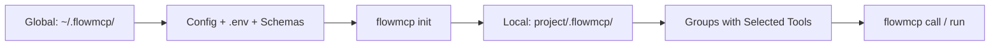

[]() 

# FlowMCP CLI

Command-line tool for developing, validating, and managing FlowMCP schemas.

## Description

FlowMCP CLI is a developer tool for working with FlowMCP schemas — structured API definitions that enable AI agents to interact with external services. The CLI provides schema validation, live API testing, repository imports, delta-based updates, and an MCP server mode for integration with AI agent frameworks like Claude Code.

## Architecture



| Level | Path | Content |
|-------|------|---------|
| **Global** | `~/.flowmcp/` | Config, .env with API keys, all imported schemas |
| **Local** | `{project}/.flowmcp/` | Project config, groups with selected tools |

## Quickstart

```bash
git clone https://github.com/FlowMCP/flowmcp-cli.git
cd flowmcp-cli
npm i
npx flowmcp init
```

## Commands

### Setup

| Command | Description |
|---------|-------------|
| `flowmcp init` | Interactive setup — creates global and local config |
| `flowmcp status` | Show config, sources, groups, and health info |
| `flowmcp --help` | Show help with health warnings |

### Tool Discovery (Agent Mode)

| Command | Description |
|---------|-------------|
| `flowmcp search <query>` | Find available tools by keyword |
| `flowmcp add <tool-name>` | Activate a tool for this project |
| `flowmcp remove <tool-name>` | Deactivate a tool |
| `flowmcp reload <tool-name>` | Remove and re-add a tool (force refresh) |
| `flowmcp list` | Show active tools |

### Schema Management

| Command | Description |
|---------|-------------|
| `flowmcp schemas` | List all available schemas and their tools |
| `flowmcp import <url> [--branch name]` | Import schemas from a GitHub repository |
| `flowmcp import-registry <url>` | Import schemas from a registry URL |
| `flowmcp update [source-name]` | Update schemas from remote registries (hash-based delta) |

### Group Management

| Command | Description |
|---------|-------------|
| `flowmcp group list` | List all groups and their tool counts |
| `flowmcp group append <name> --tools "refs"` | Add tools to a group (creates group if new) |
| `flowmcp group remove <name> --tools "refs"` | Remove tools from a group |
| `flowmcp group set-default <name>` | Set the default group |

### Prompt Management

| Command | Description |
|---------|-------------|
| `flowmcp prompt list` | List all prompts across groups |
| `flowmcp prompt search <query>` | Search prompts by keyword |
| `flowmcp prompt show <group/name>` | Show a specific prompt with content |
| `flowmcp prompt add <group> <name> --file <path>` | Add a prompt from a file |
| `flowmcp prompt remove <group> <name>` | Remove a prompt |

### Validation & Testing

| Command | Description |
|---------|-------------|
| `flowmcp validate [path]` | Validate schema structure against FlowMCP spec |
| `flowmcp validate` (no path) | Validate all schemas in the default group |
| `flowmcp validate-catalog <dir>` | Validate a catalog directory (registry, schemas, agents) |
| `flowmcp test project [--route name] [--group name]` | Test default group with live API calls |
| `flowmcp test user [--route name]` | Test all user schemas with live API calls |
| `flowmcp test single <path> [--route name]` | Test a single schema file |

### Grading (Memo 036)

`flowmcp dev grade` follows a 2-phase file-mode workflow (no API key required — harness produces scores).

| Command | Description |
|---------|-------------|
| `flowmcp dev grade <path> --emit-prompts [--workdir D]` | **Phase 1**: write `prompts.json` + `state.json` |
| `flowmcp dev grade <path> --consume-scores <scores.json>` | **Phase 2**: compute grade, write report |
| `--reports-dir <path>` | Override reports directory (default: `proofs/grade-reports/`) |
| `--on-conflict <skip\|abort>` | NO-OVERWRITE strategy (default: `skip`) |

For end-to-end grading (wraps both phases + Subagent scoring), use the workbench skills:

```bash
/grade-score-single --schema schemas/mudab/marine-data.mjs
/grade-score-batch --schemas grade-list.txt
```

Spec: `flowmcp-spec/spec/v4.0.0/22-scoring-protocol.md`.

### Agent Management

| Command | Description |
|---------|-------------|
| `flowmcp import-agent <agent-name>` | Import an agent definition from the registry |

### Schema Migration

| Command | Description |
|---------|-------------|
| `flowmcp migrate <path>` | Migrate a schema file from v2 to v3 (routes -> tools, version bump) |
| `flowmcp migrate <dir>` | Migrate all schema files in a directory |
| `flowmcp migrate --all [dir]` | Migrate all schemas recursively (defaults to cwd) |
| `flowmcp migrate <path> --dry-run` | Preview migration changes without writing |

### Resource Management (SQLite)

| Command | Description |
|---------|-------------|
| `flowmcp resource create <schema-path> [--basis name] [-y]` | Create SQLite databases for file-based resources in a schema |
| `flowmcp resource migrate [--basis name] [--dry-run] [-y]` | Migrate old-format database paths to new convention |

### Cache Management

| Command | Description |
|---------|-------------|
| `flowmcp cache status` | Show cached entries, sizes, and namespaces |
| `flowmcp cache clear [namespace]` | Clear all cache or a specific namespace |

### Execution

| Command | Description |
|---------|-------------|
| `flowmcp call list-tools [--group name]` | List available tools in default/specified group |
| `flowmcp call <tool-name> [json] [--group name]` | Call a tool with optional JSON input |
| `flowmcp call <tool-name> [json] --no-cache` | Call a tool bypassing cache |
| `flowmcp call <tool-name> [json] --refresh` | Call a tool and refresh cache |
| `flowmcp run [--group name]` | Start MCP server (stdio transport) |

## Tool Reference Format

```
source/file.mjs              # All tools from a schema
source/file.mjs::routeName   # Single tool from a schema
```

## Global Flags

| Flag | Short | Description |
|------|-------|-------------|
| `--help` | `-h` | Show help |
| `--group <name>` | | Target a specific group |
| `--route <name>` | | Filter by route name (for test commands) |
| `--branch <name>` | | Git branch for import |
| `--tools "refs"` | | Comma-separated tool references (for group commands) |
| `--force` | | Force overwrite (for add) |
| `--no-cache` | | Bypass cache (for call) |
| `--refresh` | | Refresh cached result (for call) |
| `--all` | | Apply to all schemas (for migrate) |
| `--dry-run` | | Preview changes without writing (for migrate, resource migrate) |
| `--file <path>` | | File path (for prompt add) |
| `--basis <name>` | | Resource basis directory name (default: flowmcp) |
| `--yes` | `-y` | Auto-confirm prompts |

## Workflow Examples

### Basic Setup and Usage

```bash
# 1. Setup (quick install imports schemas and creates default group)
flowmcp init

# 2. Or: Manual import and group creation
flowmcp import https://github.com/FlowMCP/flowmcp-schemas
flowmcp group append crypto --tools "flowmcp-schemas/coingecko/simplePrice.mjs,flowmcp-schemas/etherscan/getBalance.mjs"
flowmcp group set-default crypto

# 3. Validate and test
flowmcp validate
flowmcp test project

# 4. Use tools
flowmcp call list-tools
flowmcp call coingecko_simplePrice '{"ids":"bitcoin","vs_currencies":"usd"}'

# 5. Update schemas from remote
flowmcp update

# 6. Run as MCP server
flowmcp run
```

### Schema Development

```bash
# Validate a single schema file
flowmcp validate ./my-schema.mjs

# Validate an entire directory
flowmcp validate ./schemas/my-provider/

# Test with live API calls
flowmcp test single ./my-schema.mjs

# Test a specific route only
flowmcp test single ./my-schema.mjs --route getBalance
```

## Testing

`flowmcp dev test single <path>` validates all five v4 primitives declared in a
single schema file and prints a consolidated summary:

| Primitive  | Source in Schema                       | Test Strategy                                  |
|------------|-----------------------------------------|------------------------------------------------|
| Tools      | `main.tools[*].tests`                   | HTTP fetch via `FlowMCP.fetch`                 |
| Resources  | `main.resources[*].queries[*].tests`    | `FlowMCP.executeResource` (SQLite readonly)    |
| Skills     | `main.skills[*].tests`                  | Structural (placeholder + prefill resolution)  |
| Prompts    | `main.prompts[*].tests`                 | Placeholder resolution                          |
| Selections | Selection file (transitive)             | Member iteration + aggregate                   |

Example output:

```
Tools:       0/0 (none declared)
Resources:   6/6 PASS (3 queries × 2 tests each)
Skills:      1/1 PASS (structural)
Prompts:     none
Selections:  4/4 Members PASS

Overall: PASS
```

### Filtering with `--only`

Use `--only=<csv>` to restrict a run to selected primitives. Allowed values:
`tools`, `resources`, `skills`, `prompts`, `selections` (comma-separated for
multiple).

```bash
# Only run Resource tests
flowmcp dev test single ./schema.mjs --only=resources

# Run Resources and Skills only
flowmcp dev test single ./schema.mjs --only=resources,skills
```

### Structured Output with `--json`

Add `--json` to emit a machine-readable summary. The JSON object contains
`overall`, `primitives` (per-primitive counts), and `tests` (per-test detail).
This format is consumed by downstream tooling such as the Memo 035 conformance
report and the Memo 028 Grade Report.

```bash
flowmcp dev test single ./schema.mjs --json
```

One-shot LLM tests for Skills are intentionally not a CLI feature; they run in
the Harness (see Spec v4.0.0 §10).


### Schema Migration (v2 to v3)

```bash
# Preview what would change
flowmcp migrate ./schemas/ --dry-run

# Migrate a single file
flowmcp migrate ./schemas/provider/schema.mjs

# Migrate all schemas in a directory
flowmcp migrate --all ./schemas/
```

### Agent Import

```bash
# Import an agent from the registry
flowmcp import-agent my-agent

# Validate a catalog directory
flowmcp validate-catalog ./my-catalog/
```

### Catalog Validation

The `validate-catalog` command checks a catalog directory for structural correctness:

- `registry.json` must exist and match the directory name
- All referenced schema files must exist
- All referenced shared files must exist
- All agent manifest files must exist
- Schema spec version must be valid (2.0.0 or 3.0.0)

```bash
flowmcp validate-catalog ./catalogs/my-catalog/
```

```json
{
    "status": true,
    "catalog": "my-catalog",
    "schemaSpec": "3.0.0",
    "counts": {
        "shared": 2,
        "schemas": 15,
        "agents": 1
    },
    "errors": [],
    "warnings": []
}
```

### Resource Management

For schemas with SQLite-based resources:

```bash
# Create databases defined in a schema
flowmcp resource create ./schemas/provider/schema.mjs -y

# Preview database path migrations
flowmcp resource migrate --dry-run

# Execute migrations
flowmcp resource migrate -y
```

### Cache Management

```bash
# Check cache size and entries
flowmcp cache status

# Clear everything
flowmcp cache clear

# Clear a specific namespace
flowmcp cache clear etherscan
```

### Prompt Management

```bash
# List all prompts
flowmcp prompt list

# Search for prompts
flowmcp prompt search "blockchain"

# View a specific prompt
flowmcp prompt show analysis/token-report

# Add a prompt from a markdown file
flowmcp prompt add analysis token-report --file ./prompts/token-report.md

# Remove a prompt
flowmcp prompt remove analysis token-report
```

## Documentation

Full documentation at [docs.flowmcp.org](https://docs.flowmcp.org). See the [CLI Reference](https://docs.flowmcp.org/guides/cli-reference) for detailed command documentation.

## License

MIT
