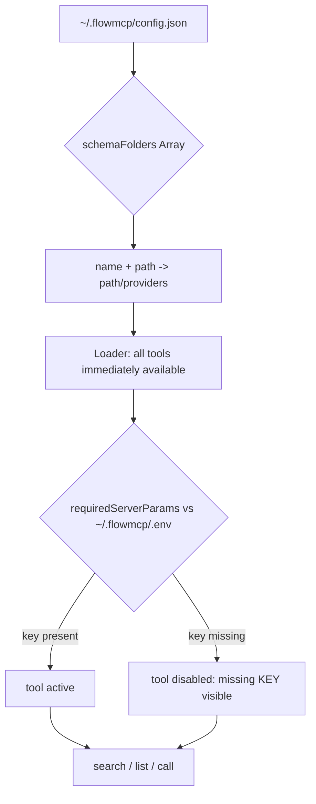

[]() 

# FlowMCP CLI

Command-line tool for developing, validating, and managing FlowMCP schemas.

## Description

FlowMCP CLI is a developer tool for working with FlowMCP schemas — structured API definitions that enable AI agents to interact with external services. The CLI reads schemas directly from the folders you list in `schemaFolders[]` (one global config), makes every tool immediately callable (no activation step), provides schema validation, live API testing, and an MCP server mode for integration with AI agent frameworks like Claude Code.

## Architecture



One global config (`~/.flowmcp/config.json`) points — by path — directly at your schema folders. The folder on disk is the single source of truth: no copy, no registry, no per-project activation.

| Setting | Path | Content |
|---------|------|---------|
| **Config** | `~/.flowmcp/config.json` | `envPath`, `schemaFolders[]`, `grading*` |
| **Keys** | `~/.flowmcp/.env` | API keys (never in the repo) |
| **Schemas** | `schemaFolders[].path` | Your schema repo (`providers/` + `selections/`) |

## Quickstart

```bash
git clone https://github.com/FlowMCP/flowmcp-cli.git
cd flowmcp-cli
npm i
npx flowmcp init
```

Then point the CLI at a schema folder by adding it to `~/.flowmcp/config.json`:

```json
{
    "envPath": "~/.flowmcp/.env",
    "schemaFolders": [
        { "name": "development", "path": "~/path/to/flowmcp-schemas/schemas/v4.0.0" }
    ]
}
```

Every tool in every folder is now callable — no `add`. `path` may be `~`- or anchor-relative. A tool whose required API key is missing from `.env` is shown as `[disabled: missing KEY]` and skipped; all other tools stay usable.

## Commands

### Setup

| Command | Description |
|---------|-------------|
| `flowmcp init` | Interactive setup — creates global and local config |
| `flowmcp status` | Show config, sources, groups, and health info |
| `flowmcp --help` | Show help with health warnings |

### Tool Discovery (Agent Mode)

| Command | Description |
|---------|-------------|
| `flowmcp search <query>` | Find tools by keyword (key-gated tools flagged `disabled`) |
| `flowmcp list` | Show all tools from the configured schemaFolders (with `disabledCount`) |

> No `add`/`remove`/`reload`/`group`: every tool in every configured folder is immediately available to `search`/`list`/`call`. To add or remove a folder, edit `schemaFolders[]` in `~/.flowmcp/config.json`.

### Schema Management

| Command | Description |
|---------|-------------|
| `flowmcp schemas` | List all schemas (from the configured schemaFolders) and their tools |

> No `import`/`import-registry`/`update`: there is no registry or internet sync. Clone schema repos yourself (`gh repo clone …`) and add the path to `schemaFolders[]`.

### Prompt Management

| Command | Description |
|---------|-------------|
| `flowmcp prompt list` | List all prompts across groups |
| `flowmcp prompt search <query>` | Search prompts by keyword |
| `flowmcp prompt show <group/name>` | Show a specific prompt with content |
| `flowmcp prompt add <group> <name> --file <path>` | Add a prompt from a file |
| `flowmcp prompt remove <group> <name>` | Remove a prompt |

### Validation & Testing

| Command | Description |
|---------|-------------|
| `flowmcp schema-check [path]` | Structure-only check (OFFLINE) against the FlowMCP spec — no API calls. Run `grading deterministic` before shipping |
| `flowmcp schema-check` (no path) | Structure-check all schemas in the default group |
| `flowmcp validate-catalog <dir>` | Validate a catalog directory (registry, schemas, agents) |
| `flowmcp grading deterministic <namespace>/<schema>` | Structural validate + deterministic data pretest (HTTP 200 + non-empty data), no scoring (alias: `det`) |
| `flowmcp grading deterministic <namespace>/tool/<name>` | Restrict the pretest to one tool |
| `flowmcp grading deterministic <id> --only=<csv>` | v4-primitive view: `tools \| resources \| skills \| prompts \| selections` |

### Grading

The `grading` commands run the production grading system (v2) against a
workbench island. They are reachable both as `flowmcp grading ...` and
`flowmcp dev grading ...` (the `dev` prefix is optional).

| Command | Description |
|---------|-------------|
| `flowmcp grading non-deterministic <ns\|selection> --emit-prompts` | Stage 1 (alias `nondet`): deterministic pretest + emit grading prompts (handoff). The schema is read live from `schemaFolders[]`; the island is built on first run — no separate import step |
| `flowmcp grading non-deterministic <ns\|selection> --consume-scores <path>` | Stage 3: consume harness scores, rebuild index, finalize |
| `flowmcp grading export <ns\|selection>` | Export the graded state (`index.json`) back to the source |
| `flowmcp grading state <ns\|selection>` | Show the current rollup status (read-only) |
| `flowmcp grading plan <ns> [--target <grade>]` | Read-only entry worklist: which schemas need (re-)grading — ungraded, `schemaHash`-stale, or below `--target` — and which are fresh/skipped |
| `flowmcp grading finalize <ns> [--target <grade>]` | Rebuild the namespace `index.json` + `grade.json` from the per-schema gradings, then print the same recommendation (worklist) as `plan` |

Flags: `--phase <area>` restricts grading to a single area/skill;
`--target <grade>` adds a quality lens to `plan`/`finalize` (worklist also
includes schemas below the target; never lowers the quality bar);
`--on-conflict <abort\|skip\|overwrite>` sets the write-conflict policy
(default: no overwrite); `--grading-data <path>` overrides the island location
for a single call.

#### Island location

The grading island defaults to `~/.flowmcp/grading` (alongside the global
`~/.flowmcp/.env` and `config.json` — the single source of truth). Resolution
order (all explicit, no silent fallback):

1. `--grading-data <path>` flag (resolved against the current directory)
2. `FLOWMCP_GRADING_DATA` env var (resolved against the current directory)
3. `"gradingDataDir"` in `~/.flowmcp/config.json` (resolved against `~/.flowmcp`)
4. default `~/.flowmcp/grading`

To set a persistent custom location, add to `~/.flowmcp/config.json`:

```json
{ "gradingDataDir": "grading" }
```

A relative value is resolved against `~/.flowmcp`; an absolute value is used as-is.

#### Stage model

Grading runs in three stages. The CLI owns Stages 1 and 3; the **harness**
(your Claude Code agent loop) owns Stage 2. The schema source is read live from
`schemaFolders[]` on every run — there is no separate intake/import step, and the
island (`index.json`/`prompts.json`/`state.json`/grade snapshots) is built on the
first run.

| Stage | Owner | What happens |
|-------|-------|--------------|
| 1 — Deterministic | CLI | `grading non-deterministic --emit-prompts` reads the schema live from `schemaFolders[]`, builds the island on first run, runs the deterministic pretest (live HTTP checks — the request is never persisted) and the deterministic graders, then emits `prompts.json` + `state.json` for the handoff |
| 2 — Non-deterministic | Harness | The agent loop reads `prompts.json`/`state.json` and grades each area (`start-grade → evaluate → apply-improvement`) — this is the only stage outside the CLI |
| 3 — Finalize | CLI | `grading non-deterministic --consume-scores <path>` reads the harness scores, computes grades, rebuilds `index.json` (5-status rollup) and finalizes the state for `export` |

#### Flow auto-detection

The target's path decides the test flow, the tier, and the maximum reachable grade:

- `providers/<target>/` → **provider test** — tier `autonomous`, max **grade B**.
- `selections/<target>/` → **selection test** — tier `group-bound`, **grade A** reachable.
- A target that exists under both `providers/` and `selections/` is rejected with
  an error and a fix hint; pass an explicit path to disambiguate.

#### Handoff to the harness

`grading non-deterministic --emit-prompts` does not grade non-deterministically
itself. It writes:

- `prompts.json` — one grading prompt per area, each carrying a Goal-Block.
- `state.json` — the run baton (which areas are pending/done), updated atomically
  and never overwritten.

The harness then drives the non-deterministic loop: an `Agent()` runs each
area's grading prompt against the goal. A small fast evaluator (Haiku) reads
**only the transcript** — it calls no tools — to decide when the goal is met.
For this to work, the loop surfaces its progress into the transcript with
`[GRADING]` lines, for example:

```
[GRADING] area=single-test/getFirstPrice schema-valid=ok status=graded written=ok
[GRADING] PROGRESS 7/12
[GRADING] DONE
```

When the goal is reached, hand the scores back to the CLI:

```bash
# Stage 1 — deterministic pretest + emit prompts (provider test)
flowmcp grading non-deterministic providers/defillama --emit-prompts

# Stage 2 — harness grades each area (outside the CLI), writing scores

# Stage 3 — consume the harness scores, rebuild the index, finalize
flowmcp grading non-deterministic providers/defillama --consume-scores scores.json

# Inspect the rollup, then export the graded state back to the source
flowmcp grading state providers/defillama
flowmcp grading export providers/defillama
```

### Agent Management

| Command | Description |
|---------|-------------|
| `flowmcp import-agent <agent-name>` | Import an agent definition from the registry |

### Schema Migration

| Command | Description |
|---------|-------------|
| `flowmcp migrate <path>` | Migrate a schema file from v2 to v3 (routes -> tools, version bump) |
| `flowmcp migrate <dir>` | Migrate all schema files in a directory |
| `flowmcp migrate --all [dir]` | Migrate all schemas recursively (defaults to cwd) |
| `flowmcp migrate <path> --dry-run` | Preview migration changes without writing |

### Resource Management (SQLite)

| Command | Description |
|---------|-------------|
| `flowmcp resource create <schema-path> [--basis name] [-y]` | Create SQLite databases for file-based resources in a schema |
| `flowmcp resource migrate [--basis name] [--dry-run] [-y]` | Migrate old-format database paths to new convention |

### Cache Management

| Command | Description |
|---------|-------------|
| `flowmcp cache status` | Show cached entries, sizes, and namespaces |
| `flowmcp cache clear [namespace]` | Clear all cache or a specific namespace |

### Execution

| Command | Description |
|---------|-------------|
| `flowmcp call list-tools` | List all available tools from the schemaFolders |
| `flowmcp call <tool-name> [json]` | Call a tool with optional JSON input (no activation needed) |
| `flowmcp call <tool-name> [json] --no-cache` | Call a tool bypassing cache |
| `flowmcp call <tool-name> [json] --refresh` | Call a tool and refresh cache |
| `flowmcp run` | Start MCP server (stdio transport) |

### Diagnostics

| Command | Description |
|---------|-------------|
| `flowmcp doctor` | Structural health check over the configured `schemaFolders[]` — are the shared lists, required modules, refs and config present and consistent? Reports by error code, offline (no live API probe). Exits `1` if any `ERROR`-severity check fails. |
| `flowmcp version` / `flowmcp --version` | Print the CLI name and version — answers "which flowmcp is running?" |

`doctor` runs seven checks: `config-single-source` (every `schemaFolders[]` path exists), `schema-load` (every schema module loads), `shared-list-resolve` (every declared `sharedLists` ref resolves non-empty — `LST-001`/`HND-001`/`LST-006`), `module-present` (every `requiredLibraries` entry actually **loads** — a real `import`/dlopen, not just `require.resolve` — from allowed-libraries, the CLI base or the schema dir; a genuinely missing lib is `LIB-001` with a copy-pasteable install command that uses `github:FlowMCP/<repo>` for org-internal add-ons, an installed-but-unloadable native binding is `LIB-BINDING` with a rebuild hint), `key-coverage` (`requiredServerParams` vs `.env` — `INFO` only; missing keys disable individual tools, they are not a structural failure), and `cli-version`. The machine-readable result is JSON on stdout; a human summary prints to stderr (suppressed by `--json`).

### Error Codes

Every caught failure the CLI surfaces carries a `PREFIX-NNN` code (3–4 uppercase letters, a dash, three digits; e.g. `LST-001`, `CFG-002`, `SQL-004`). Severity is `ERROR` (blocks), `WARNING`, or `INFO`. A **declared** `sharedLists` ref that cannot be located or resolved now **fails loud** with a code instead of silently returning an empty list. `flowmcp doctor` reads these codes back. The runtime code namespace is registered in the [specification wayfinder](https://github.com/FlowMCP/flowmcp-spec) (`09-validation-rules.md → CLI Runtime Error Codes`); each code's authoritative home is its `try`/`catch` site in `src/task/FlowMcpCli.mjs`.

## Tool Reference Format

```
source/file.mjs              # All tools from a schema
source/file.mjs::routeName   # Single tool from a schema
```

## Add-ons

### Concept

Add-ons are format-specific adapters that the FlowMCP CLI loads on demand when a schema declares a resource with a non-trivial data format. They encapsulate knowledge that does not belong in the schema definition — such as how a particular SQLite database must be structured, which auto-tools can be derived from it, or how a quality guarantee (seal) is verified.

Add-ons live as standalone GitHub repositories, not as part of the CLI. This separates schema logic (what is being queried?) from format logic (how is the format structured?) and allows both to evolve independently. The CLI loads add-ons via the `github:` shorthand on demand, as soon as a schema references them.

The promise: a schema that points to an add-on automatically gets generated tools on a data source that the add-on has verified as spec-compliant and quality-assured. The schema author writes no SQL code, and the add-on author writes no schema boilerplate.

### Example: sqlite-gtfs

The first add-on is [`geo-gtfs-toolkit`](https://github.com/FlowMCP/geo-gtfs-toolkit). It converts GTFS Schedule feeds (CSV in ZIP) into spec-compliant SQLite databases and provides capability-based auto-tool generation. A schema references it like this:

```javascript
export const schema = {
    namespace: 'gtfsde',
    name: 'gtfsde-transit-v2',
    version: '2.0.0',
    main: {
        resources: [
            {
                source:      'sqlite-gtfs',
                mode:        'file-based',
                path:        '${FLOWMCP_RESOURCES}/gtfs-de.db',
                addon:       'geo-gtfs-toolkit',
                addonSource: 'github:FlowMCP/geo-gtfs-toolkit'
            }
        ]
    }
}
```

`source: 'sqlite-gtfs'` signals to the CLI that an add-on is required. `addon` names the package (`geo-*-toolkit`), while `addonSource` points to the GitHub clone-URL whose repo keeps its own name (`*-sqlite-toolkit` for the three sqlite repos) — always `github:<org>/<repo>`, no npm registry. `${FLOWMCP_RESOURCES}` is a path variable (see the next section) and resolves to the default `~/.flowmcp/resources/`.

### Discovery: ADDON_REGISTRY

The CLI keeps one registry entry per known `source` type, **hardcoded** in `src/data/addons.mjs` in V1. Each entry has three fields:

```javascript
export const ADDON_REGISTRY = {
    'sqlite-gtfs': {
        name:           'geo-gtfs-toolkit',
        source:         'github:FlowMCP/geo-gtfs-toolkit',
        defaultVersion: 'main'
    }
}
```

`name` is the add-on identifier (must match `addon` in the schema), `source` is the `github:` location, and `defaultVersion` is the Git ref used when the schema does not set an `addonVersion`. In V1 the registry is hardcoded; later versions may extend it from external sources.

Spec reference: [`flowmcp-spec/spec/v4.0.0/13-resources.md`](../flowmcp-spec/spec/v4.0.0/13-resources.md), section "SQLite-GTFS Resources".

Related sections: [Path Variables](#path-variables) (`${FLOWMCP_RESOURCES}`), [FlowMCP Directory Structure](#flowmcp-directory-structure) (default location `~/.flowmcp/resources/`), [Data Sources — User Responsibility](#data-sources--user-responsibility) (databases are created by the user).

## Path Variables

Path variables allow user configurability without rewriting a schema for every setup. They typically appear in the `path` field of a schema resource — for example, to point at a locally stored SQLite database whose location the user decides.

The CLI resolves the following variables:

| Variable | Resolution | Default | Spec Reference |
|----------|------------|---------|------------|
| `${FLOWMCP_RESOURCES}` | env var `FLOWMCP_RESOURCES` | `~/.flowmcp/resources/` | spec primitive `main.resources` |
| `${HOME}` | env var `HOME` | required (OS) | — |
| `~` | tilde expansion to `$HOME` | required (OS) | — |

Resolution happens in two steps: first check whether the env var is set; if not, fall back to the documented default. Variables without a default (such as `${HOME}`) must be provided by the operating system, otherwise the error case applies.

### Error `RES035`

When the CLI cannot resolve a variable — for example because an unknown variable appears in the `path`, or an env var without a default is empty — a resource `call` aborts with `RES035`. Users fix this by setting the env var explicitly (`export FLOWMCP_RESOURCES=/path/to/dir`) or by moving the database to the default location.

### The `FLOWMCP_*` Name Family

Path variables follow the pattern spec-primitive name → variable name. `${FLOWMCP_RESOURCES}` binds directly to the spec primitive `main.resources` and establishes the `FLOWMCP_*` name family. Future extensions are foreseeable — such as `${FLOWMCP_LOGS}` for log directories or `${FLOWMCP_CACHE}` as an explicit cache hook. In V1 only `${FLOWMCP_RESOURCES}` is implemented.

Example for an alternative location:

```bash
export FLOWMCP_RESOURCES=/Volumes/MyData/flowmcp
flowmcp call <tool-name>
```

Related sections: [Add-ons](#add-ons) (schema examples with `${FLOWMCP_RESOURCES}`), [FlowMCP Directory Structure](#flowmcp-directory-structure) (default resolution).

## Data Sources — User Responsibility

FlowMCP distributes **no** provider data in its public repositories. There are three reasons, all of which apply at once.

**License.** GTFS feeds and comparable provider datasets are each subject to their own license terms — from CC BY 4.0 through custom EULAs to provider-specific clauses. Putting the data into a public repository unintentionally shifts this compliance obligation onto the repository and all its forks. FlowMCP avoids this by keeping the data with the user.

**Scale.** Real provider feeds reach 40 MB and more (the DB Bahn FV schedule is around 50 MB, regional VBB feeds larger still). Such data volumes in the Git history bloat every clone and make the repository unwieldy. Code and data belong in different lifecycles.

**Freshness.** Feeds are updated daily or weekly. A repository state would always be outdated — the user would have to check regularly whether the version bundled in the repository still matches reality. It is cleaner for the user to pull and convert directly from the provider.

### User Workflow

The path from a provider feed to a database usable by FlowMCP has four steps:

1. **Download** the GTFS feed from the provider (examples: `gtfs.de/de/feeds/`, regional open-data portals, provider-owned download pages)
2. **Convert** via the `geo-gtfs-toolkit` add-on (see the add-on README for the exact invocation)
3. **Store** the database at `${FLOWMCP_RESOURCES}/<name>.db` (default `~/.flowmcp/resources/<name>.db`)
4. **Use** the schema — it is already available via `call`/`list` once its folder is in `schemaFolders[]` (no activation step)

Concrete command examples:

```bash
# 1. Download the GTFS feed (example)
curl -O https://download.gtfs.de/germany/free/latest.zip

# 2. Convert via the add-on (see geo-gtfs-toolkit README)
cd ~/code/geo-gtfs-toolkit
node convert.mjs --input=~/Downloads/latest.zip --output=~/.flowmcp/resources/gtfs-de.db

# 3. Optional: move the database to a different location
#    (when ${FLOWMCP_RESOURCES} does not point at the default)

# 4. Call the tool directly (the schema's folder is in schemaFolders[])
flowmcp call <tool-name>
```

### Pre-Push Protection

The add-on repository (`geo-gtfs-toolkit`) ships a verification script `scripts/check-no-provider-data.sh` that detects large or provider-specific files before each commit or push and aborts the push. This policy also applies to user forks — contributors should wire the script into their own pre-push hooks.

Anyone contributing a schema for a new provider supplies **only the schema and the path variable** — never the feed itself.

Related sections: [Path Variables](#path-variables) (step 3 uses `${FLOWMCP_RESOURCES}`), [FlowMCP Directory Structure](#flowmcp-directory-structure) (default storage location), [Add-ons](#add-ons) (step 2 requires an add-on).

## FlowMCP Directory Structure

FlowMCP uses a central user directory `~/.flowmcp/` that stays consistent across all projects. It holds API keys, cache, and user resources in one place — individual values can be overridden per project, while the default lookup stays central.

```
~/.flowmcp/
├── .env             ← API Keys (Single Source of Truth)
├── cache/           ← Schema cache (CLI-managed)
└── resources/       ← User DBs (default for ${FLOWMCP_RESOURCES})
```

| Path | Purpose | Managed By | Cross-Reference |
|------|-------|------------|--------------|
| `~/.flowmcp/.env` | API keys, provider credentials | user (manual) | see the `.env` section below |
| `~/.flowmcp/cache/` | schema cache, add-on cache | CLI (automatic) | — |
| `~/.flowmcp/resources/` | user databases (e.g. converted GTFS) | user (manual or via add-on) | `${FLOWMCP_RESOURCES}` default |

### `.env` — Single Source of Truth

The global `~/.flowmcp/.env` is the single source of truth for the API keys of all FlowMCP tools. It is maintained manually by the user; the CLI never creates it automatically and never overwrites it. A project-local override can be placed at `projects/<name>/.flowmcp/.env` — the lookup path is project-local first, then global.

### `resources/` — Default for `${FLOWMCP_RESOURCES}`

The directory `~/.flowmcp/resources/` is the default resolution for the path variable `${FLOWMCP_RESOURCES}`. Users can set the env var to a different location — such as an external drive or a central data volume — and the CLI then resolves dynamically to that location.

```bash
export FLOWMCP_RESOURCES=/Volumes/MyData/flowmcp
```

Related sections: [Path Variables](#path-variables) (resolution logic), [Data Sources — User Responsibility](#data-sources--user-responsibility) (why the databases live here, not in the repository).

## Global Flags

| Flag | Short | Description |
|------|-------|-------------|
| `--help` | `-h` | Show help |
| `--version` | | Print the CLI name and version |
| `--route <name>` | | Filter by route name (for test commands) |
| `--no-cache` | | Bypass cache (for call) |
| `--refresh` | | Refresh cached result (for call) |
| `--all` | | Apply to all schemas (for migrate) |
| `--dry-run` | | Preview changes without writing (for migrate, resource migrate) |
| `--file <path>` | | File path (for prompt add) |
| `--basis <name>` | | Resource basis directory name (default: flowmcp) |
| `--yes` | `-y` | Auto-confirm prompts |

## Workflow Examples

### Basic Setup and Usage

```bash
# 1. Setup
flowmcp init

# 2. Point the CLI at a schema folder (clone it yourself first):
#    gh repo clone FlowMCP/flowmcp-schemas ~/flowmcp-schemas
#    then add to ~/.flowmcp/config.json:
#      "schemaFolders": [ { "name": "development", "path": "~/flowmcp-schemas/schemas/v4.0.0" } ]

# 3. Discover tools (all immediately available — no add)
flowmcp search coingecko
flowmcp list

# 4. Use tools directly
flowmcp call list-tools
flowmcp call simple_price_coingecko '{"ids":"bitcoin","vs_currencies":"usd"}'

# 5. Run as MCP server
flowmcp run
```

### Schema Development

```bash
# Structure-check a single schema file (offline, no API calls)
flowmcp schema-check ./my-schema.mjs

# Structure-check an entire directory
flowmcp schema-check ./schemas/my-provider/

# Deterministic validation (structural validate + data pretest) for one schema
flowmcp grading deterministic my-namespace/my-schema

# Restrict the pretest to one tool
flowmcp grading deterministic my-namespace/tool/getBalance
```

## Testing

> **Note:** `flowmcp dev test` (`project` / `user` / `single`) was **removed**.
> Its PASS criterion (HTTP 200 only) was a strict subset of the deterministic
> grading pretest, which additionally requires non-empty data (HTTP 200 **and**
> real data). Schema checking now has **one** path: `grading`.

`flowmcp grading deterministic <id>` runs a structural validation **plus** the
deterministic data pretest for a single schema (`<namespace>/<schema>`) or a
single tool (`<namespace>/tool/<name>`). It does **not** emit prompts and does
**not** run the non-deterministic LLM scoring. The `--only` flag carries the
v4-primitive view that used to live in `dev test`:

| Primitive  | Source in Schema                       | Test Strategy                                  |
|------------|-----------------------------------------|------------------------------------------------|
| Tools      | `main.tools[*].tests`                   | Data pretest (HTTP 200 + non-empty data)       |
| Resources  | `main.resources[*].queries[*].tests`    | Data pretest (SQLite readonly)                 |
| Skills     | `main.skills[*].tests`                  | Structural (placeholder + prefill resolution)  |
| Prompts    | `main.prompts[*].tests`                 | Placeholder resolution                          |
| Selections | Selection file (transitive)             | Member iteration + aggregate                   |

### Filtering with `--only`

Use `--only=<csv>` to restrict the v4-primitive view to selected primitives.
Allowed values: `tools`, `resources`, `skills`, `prompts`, `selections`
(comma-separated for multiple).

```bash
# Only the Resource primitive view
flowmcp grading deterministic my-namespace/my-schema --only=resources

# Resources and Skills only
flowmcp grading deterministic my-namespace/my-schema --only=resources,skills
```

### Structured Output with `--json`

Add `--json` to emit a machine-readable result. The JSON object contains
`status`, `mode`, `target`, the `validate` block, the `pretest` block
(`ok`, `passedDownloadable`, `required`, `results`), `hints`, and (with
`--only`) a `primitives` block.

```bash
flowmcp grading deterministic my-namespace/my-schema --json
```

One-shot LLM tests for Skills are intentionally not a CLI feature; they run in
the Harness (see Spec v4.0.0 §10).


### Schema Migration (v2 to v3)

```bash
# Preview what would change
flowmcp migrate ./schemas/ --dry-run

# Migrate a single file
flowmcp migrate ./schemas/provider/schema.mjs

# Migrate all schemas in a directory
flowmcp migrate --all ./schemas/
```

### Agent Import

```bash
# Import an agent from the registry
flowmcp import-agent my-agent

# Validate a catalog directory
flowmcp validate-catalog ./my-catalog/
```

### Catalog Validation

The `validate-catalog` command checks a catalog directory for structural correctness:

- `registry.json` must exist and match the directory name
- All referenced schema files must exist
- All referenced shared files must exist
- All agent manifest files must exist
- Schema spec version must be valid (2.0.0 or 3.0.0)

```bash
flowmcp validate-catalog ./catalogs/my-catalog/
```

```json
{
    "status": true,
    "catalog": "my-catalog",
    "schemaSpec": "3.0.0",
    "counts": {
        "shared": 2,
        "schemas": 15,
        "agents": 1
    },
    "errors": [],
    "warnings": []
}
```

### Resource Management

For schemas with SQLite-based resources:

```bash
# Create databases defined in a schema
flowmcp resource create ./schemas/provider/schema.mjs -y

# Preview database path migrations
flowmcp resource migrate --dry-run

# Execute migrations
flowmcp resource migrate -y
```

### Cache Management

```bash
# Check cache size and entries
flowmcp cache status

# Clear everything
flowmcp cache clear

# Clear a specific namespace
flowmcp cache clear etherscan
```

### Prompt Management

```bash
# List all prompts
flowmcp prompt list

# Search for prompts
flowmcp prompt search "blockchain"

# View a specific prompt
flowmcp prompt show analysis/token-report

# Add a prompt from a markdown file
flowmcp prompt add analysis token-report --file ./prompts/token-report.md

# Remove a prompt
flowmcp prompt remove analysis token-report
```

## Documentation

Full documentation at [flowmcp.github.io](https://flowmcp.github.io). See the [CLI Reference](https://flowmcp.github.io/docs/reference/cli-reference/) for detailed command documentation.

## License & Terms of Services

FlowMCP CLI is **MIT-licensed**. The MIT license covers the CLI tooling (develop, validate, grade, deploy, env helpers) in this repository.

**Schemas accessed via the CLI** call third-party APIs, each with their own Terms of Services. Schemas may include an optional `meta.termsOfService` field with the provider's ToS URL and the date last verified. **We do not classify or interpret these Terms of Services.** Users are solely responsible for reviewing each API provider's terms before use.

FlowMCP makes no representation about ToS compliance, data licensing, or fitness for any purpose. See [DISCLAIMER.md](./DISCLAIMER.md) for details.

## License

MIT
